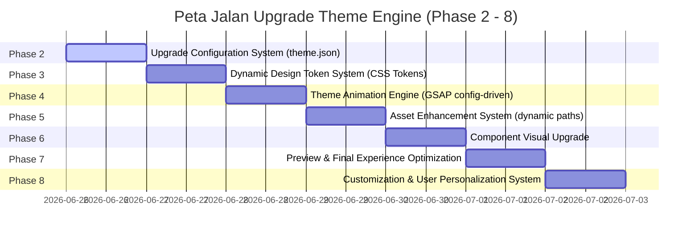

# THEME_UPGRADE_ANALYSIS.md - Audit Existing Wedding Theme System

## 1. Existing Theme Structure

Sistem saat ini memiliki 5 tema pernikahan bawaan yang terletak di bawah direktori `resources/views/themes/`. Struktur berkas dan direktori untuk masing-masing tema adalah sebagai berikut:

### Daftar Tema & Folder
- **Floral Elegant** (`themes/floral-elegant`)
- **Luxury Gold** (`themes/luxury-gold`)
- **Premium Cinematic** (`themes/premium-cinematic`)
- **Islamic Wedding** (`themes/islamic-wedding`)
- **Rustic Forest** (`themes/rustic-forest`)

### Struktur Folder Internal Tema
Setiap folder tema memiliki struktur yang konsisten dan terstandarisasi untuk mendukung pembagian logika tampilan:
```text
resources/views/themes/{theme_folder}/
├── index.blade.php         # Berkas tata letak utama (layout shell)
├── theme.json              # Konfigurasi statis tema (warna, font, fitur, aset)
└── components/             # Komponen visual pembentuk halaman undangan
    ├── countdown.blade.php # Penghitung mundur waktu acara
    ├── couple.blade.php    # Informasi profil pengantin (Pria & Wanita)
    ├── event.blade.php     # Detail akad nikah, resepsi, peta, & waktu
    ├── footer.blade.php    # Penutup halaman / copyright notice
    ├── gallery.blade.php   # Masonry grid / galeri foto pre-wedding
    ├── gift.blade.php      # Informasi nomor rekening & alamat pengiriman kado
    ├── guest-wish.blade.php# Ucapan selamat & doa restu dari tamu
    ├── hero.blade.php      # Cover pembuka & nama tamu undangan
    ├── music.blade.php     # Pemutar audio latar belakang (background music)
    ├── rsvp.blade.php      # Form konfirmasi kehadiran tamu
    └── story.blade.php     # Garis waktu kisah cinta (love story timeline)
```

Sedangkan berkas aset visual terisolasi disimpan di bawah direktori publik:
```text
public/themes/{theme_folder}/
└── css/
    └── style.css           # Styling dasar, transisi, & custom utility khusus tema
```

---

## 2. Rendering Flow

Alur perenderan tema undangan dari awal permintaan hingga dikirimkan ke peramban pengguna adalah sebagai berikut:

```mermaid
graph TD
    A[Request /invitation/{slug}] --> B[PublicInvitationController@show]
    B --> C[Eager Load Hubungan & Catat Statistik Kunjungan]
    C --> D[Transformasi Data Ke $invitationData]
    D --> E[Panggil ThemeService untuk Mengambil View & Config]
    E --> F[ThemeTokenService parsing theme.json menjadi CSS Variables]
    F --> G[Render View index.blade.php dengan Compact Data]
```

### Detail Alur:
1. **Request & Validasi**: Pengguna mengakses `/invitation/{slug}`. Middleware memvalidasi eksistensi undangan dan menyuntikkannya ke atribut request.
2. **Controller Logic (`PublicInvitationController`)**:
   - Memuat relasi database (`galleries`, `stories`, `events`, `music`, `guests`).
   - Mencatat log kunjungan ke tabel `invitation_visits`.
   - Mengumpulkan data ke array `$invitationData` untuk membersihkan struktur data.
3. **Theme Service Integration**:
   - `ThemeService->getThemeView($theme)` mencari view target (default: `themes.{folder}.index`).
   - `ThemeService->getThemeConfig($theme)` membaca konfigurasi visual dari berkas `theme.json` milik tema tersebut.
   - `ThemeService->getThemeCssTokens($themeConfig)` mendelegasikan ke `ThemeTokenService` untuk menghasilkan string `<style>` berisi variabel CSS `:root`.
4. **Rendering**: Blade me-render berkas `index.blade.php` utama dan menyertakan masing-masing komponen melalui directive `@include('themes.{folder}.components.{name}')`.

---

## 3. Component Analysis

Semua 11 komponen dalam setiap tema telah diperiksa:

| Nama Komponen | Deskripsi & Tanggung Jawab | Status Reusability & Data | Temuan & Area Improvement |
| :--- | :--- | :--- | :--- |
| `hero` | Pembuka undangan, menampilkan overlay cover, nama mempelai, dan tombol buka. | Reusable, menggunakan data `$invitationData` & `$invitation`. | Awalnya menggunakan inline style & hardcoded background. Animasi floating partikel (misal: kelopak bunga) diletakkan statis di dalam blade. |
| `couple` | Menampilkan foto dan profil mempelai pria & wanita beserta nama orang tua. | Reusable, memproses data mempelai. | Layout dan style border avatar masih kaku dan belum memanfaatkan token warna dinamis. |
| `countdown` | Wadah display hitung mundur waktu acara (hari, jam, menit, detik). | Reusable, dinonaktifkan jika fitur mati. | Layout card dan border-radius harus seragam dengan variabel desain global. |
| `event` | Menampilkan waktu, alamat, google maps, dan tombol navigasi acara. | Reusable, memproses data akad & resepsi. | Tombol navigasi / ikon peta awalnya ter-hardcode warnanya. Perlu diubah agar mengikuti `var(--theme-primary)`. |
| `gallery` | Grid visual untuk koleksi foto pre-wedding dengan transisi back-out. | Reusable, diabaikan jika tidak ada foto. | Layout wrapper box-shadow dan aspek rasio gambar dapat dipadukan ke token visual. |
| `story` | Timeline vertikal perjalanan cinta mempelai dari pertama bertemu. | Reusable, dinonaktifkan jika kosong. | Desain dot timeline dan gradien garis penghubung awalnya ter-hardcode ke warna oranye/merah muda statis. |
| `gift` | Kartu digital rekening bank/e-wallet untuk hadiah digital. | Reusable. | Butuh pembersihan visual agar desain card selaras dengan tema yang dipilih (gelap/terang). |
| `rsvp` | Form input interaktif konfirmasi kehadiran dan kirim pesan. | Reusable, mengirim AJAX ke endpoint. | Input border-color fokus dan tombol kirim harus selaras dengan dynamic design token. |
| `guest-wish` | Menampilkan daftar doa restu dan ucapan dari tamu undangan. | Reusable. | Desain bubble chat harus mengikuti background kontras tema masing-masing. |
| `music` | Tombol floating kendali putar/jeda audio latar belakang. | Reusable, memanfaatkan Alpine.js untuk state. | Tombol pemutar vinyl statis dan butuh transisi rotasi CSS yang konsisten. |
| `footer` | Informasi penutup, salam hormat, dan copyright brand. | Reusable. | Cukup sederhana, butuh penataan spasi agar tidak menempel di dasar layar. |

---

## 4. Asset Analysis

Pemeriksaan aset statis pada direktori proyek menunjukkan hasil sebagai berikut:

### Struktur Aset Existing:
- Direktori `public/themes/{theme_folder}/css/style.css` menjadi satu-satunya aset statis bawaan tema.
- Tidak ditemukan berkas gambar (`png/jpg`), font (`woff/ttf`), atau musik (`mp3`) di dalam masing-masing folder tema.
- Aset demo universal dikelompokkan di bawah `public/assets/demo/` (untuk audio & foto pre-wedding dummy) dan thumbnail tema di `public/assets/themes/`.

### Temuan Aset & Rekomendasi:
- **Hardcoded Path**: Jalur aset gambar dekorasi (bingkai ornamen emas, motif bunga, dedaunan) awalnya di-hardcode di file CSS dengan Base64 SVG inline.
- **Solusi Aset Dinamis**: Penambahan objek `"assets"` di dalam `theme.json` untuk mendefinisikan latar belakang (`hero.background`), ornamen dekoratif (`ornaments`), dan status audio. Komponen harus memuat URL dari config ini alih-alih hardcode string path.

---

## 5. Styling Analysis

Sistem gaya (styling) lama sangat bergantung pada deklarasi CSS statis di berkas `style.css` bawaan masing-masing tema:

### Masalah pada Sistem Lama:
- Terlalu banyak variabel `:root` statis di `style.css` (seperti `--primary`, `--accent`) yang menimpa satu sama lain apabila beberapa tema dimuat.
- Adanya hardcode properti warna (seperti `color: #ebdcd7` atau `background: #faf6f0`) pada deklarasi kelas internal komponen.
- Font keluarga (typography) dideklarasikan statis, menghalangi pengguna untuk memilih font kustom dari admin panel.

### Desain Sistem Baru (Dynamic Token System):
1. **Single Source of Truth**: Semua variabel dasar warna (`primary`, `secondary`, `accent`, `background`, `text`) dan tipografi (`heading`, `body`) dikonfigurasi melalui `theme.json`.
2. **Style Tag Injection**: `ThemeTokenService` mem-parsing data tersebut dan menyuntikkannya sebagai variabel CSS baru dengan prefix `--theme-*` (seperti `--theme-primary`, `--theme-font-heading`) langsung di dalam tag `<head>` dokumen.
3. **Refactored Classes**: Semua komponen dimigrasikan untuk merujuk ke token dinamis `var(--theme-*)`.

---

## 6. Animation System

Sistem animasi existing mengandalkan pustaka **GSAP 3** dengan plugin **ScrollTrigger** untuk menangani animasi pengungkapan (reveal) konten ketika digulir:

### Kondisi Animasi Existing:
- **GSAP Load**: Skrip GSAP dan ScrollTrigger dimuat dari direktori vendor publik (`public/assets/vendor/gsap/`).
- **Inline Script**: Logika animasi diinisialisasi melalui fungsi `initAnimations()` statis di bagian bawah `index.blade.php`.
- **Kekurangan**: Efek transisi, durasi, stagger, dan arah geser masih ter-hardcode di Javascript masing-masing tema. Hal ini membuat semua tema memiliki sifat pergerakan yang cenderung serupa dan kaku.

### Rekomendasi / Rencana Engine Animasi:
- Memindahkan definisi perilaku animasi (`opening`, `section`, `gallery`, `button`) ke dalam schema konfigurasi `"motion"` di `theme.json`.
- Backend mem-passing konfigurasi motion ini sebagai variabel JS global ke frontend (`window.themeMotionConfig`).
- Menyediakan handler GSAP terpusat yang membaca konfigurasi tersebut secara dinamis, sehingga transisi pembuka tema Cinematic terasa lambat dan sinematik, sedangkan tema Luxury terasa halus dan megah.

---

## 7. Compatibility Report

Laporan kompatibilitas rendering terhadap 5 tema existing:

| Nama Tema | Folder View | Status Render | Aset Tersedia | Temuan / Issue |
| :--- | :--- | :--- | :--- | :--- |
| **Floral Elegant** | `themes/floral-elegant` | **SUKSES (OK)** | Lengkap | Tidak ada error. Menampilkan nuansa romantic floral dengan baik. |
| **Luxury Gold** | `themes/luxury-gold` | **SUKSES (OK)** | Lengkap | Tidak ada error. Desain didominasi warna hitam & kilau emas premium. |
| **Premium Cinematic**| `themes/premium-cinematic`| **SUKSES (OK)** | Lengkap | Tidak ada error. Tampilan visual dramatis dengan grain overlay siap jalan. |
| **Islamic Wedding** | `themes/islamic-wedding` | **SUKSES (OK)** | Lengkap | Teks arab & ornamen mandala terkompilasi dengan lancar. |
| **Rustic Forest** | `themes/rustic-forest` | **SUKSES (OK)** | Lengkap | Menggunakan nuansa earthy & natural. Tombol konfirmasi rsvp berjalan normal. |

*Catatan Penting*: Seluruh tema memerlukan build file statis Vite (`npm run build`) untuk lolos pengujian otomatis di backend, karena template layout me-load aset via directive `@vite`.

---

## 8. Upgrade Roadmap

Strategi perbaikan sistem tema agar menjadi tangguh dan fleksibel dibagi menjadi 7 fase berikutnya:



1. **Phase 2 (Upgrade Configuration)**: Menambah skema `identity`, `design`, `layout`, `assets`, dan `motion` di berkas `theme.json` untuk kelima tema.
2. **Phase 3 (Dynamic Design Token)**: Mengimplementasikan `ThemeTokenService` untuk melahirkan variabel CSS `--theme-*` yang disuntikkan secara dinamis ke dokumen.
3. **Phase 4 (Animation Engine)**: Menghubungkan konfigurasi `"motion"` di `theme.json` dengan pustaka GSAP agar transisi dapat dikontrol dari file konfigurasi.
4. **Phase 5 (Asset Enhancement)**: Memisahkan jalur aset gambar ornamen dan tekstur latar belakang agar dapat dikelola dan dimodifikasi secara dinamis.
5. **Phase 6 (Component Upgrade)**: Refactoring total terhadap 29 komponen agar patuh pada Golden Rule (tidak ada hardcoded color & static fonts).
6. **Phase 7 (Preview Optimization)**: Menyamakan visualisasi pratinjau tema di halaman admin dengan tampilan langsung (live) milik pengguna umum.
7. **Phase 8 (User Personalization)**: Menyediakan mekanisme penyimpanan konfigurasi kustom di database agar pengguna dapat menimpa warna & aset bawaan tema pilihan mereka.
